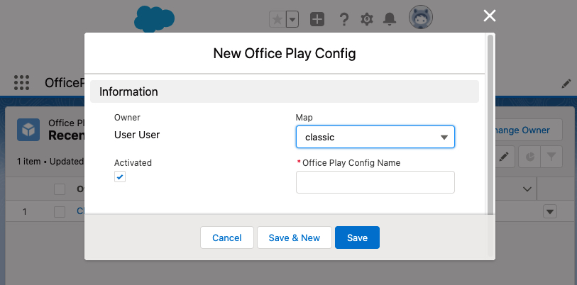
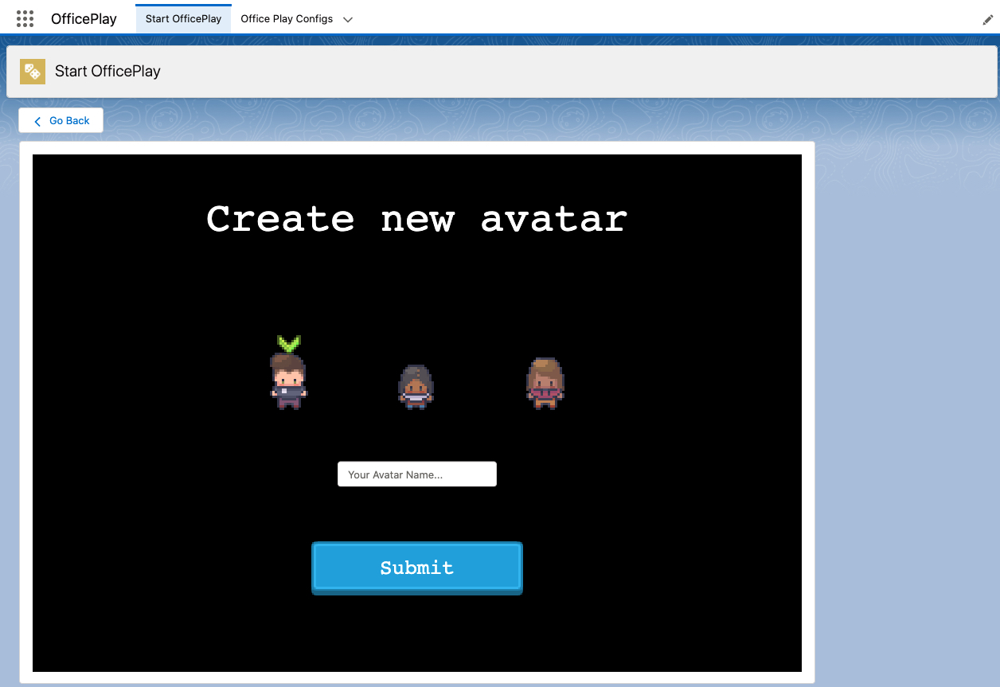

# OfficePlay Salesforce App


OfficePlay offers a virtual office experience for employees working from home who can meet up in the virtual world and walk around, talk and collaborate with each other. The solution is build completely on the Salesforce platform with Lightning Web Components and offers full multiplayer functionality.

**ℹ️&nbsp;&nbsp;Disclaimers:**

- this app is not officialy supported by Salesforce and is provided as-is without any warranties.

## Deployment Instructions

1. Clone this repository and navigate to the project folder:

   ```sh
   git clone git@github.com/flemx/OfficePlay.git
   cd OfficePlay
   ```

1. Install all the developer dependencies 

   ```sh
   yarn install
   ```

1. Bundle the TypeScript files into the package (Repeat from this step every time you make an edit to the TypeScript files)

   ```sh
   yarn build
   ```

1. Authenticate your Salesforce Org and deply the package to your Org

   ```apex
   sfdx force:source:deploy -p force-app/ -u <YOUR_USERNAME>
   ```

1. Once the package is installed in your Salesforce Org, assign the permissionset 'OfficePlay' to your authenticated user

   ```apex
   sfdx force:user:permset:assign --permsetname OfficePlay --targetusername <YOUR_USERNAME>
   ```

## Salesforce Setup Guide


1. Make sure to assign the permission set 'OfficePlay' to the users who will use the app


1. In the app launcher open the app 'OfficePlay' and under 'Office Play Configs' create a new record, this will be a virtual office invironment users can login to



1. Under the 'Start OfficePlay' you can now access the Game session previously cerated and create a chracter, multiple users can create a charcter and play together




